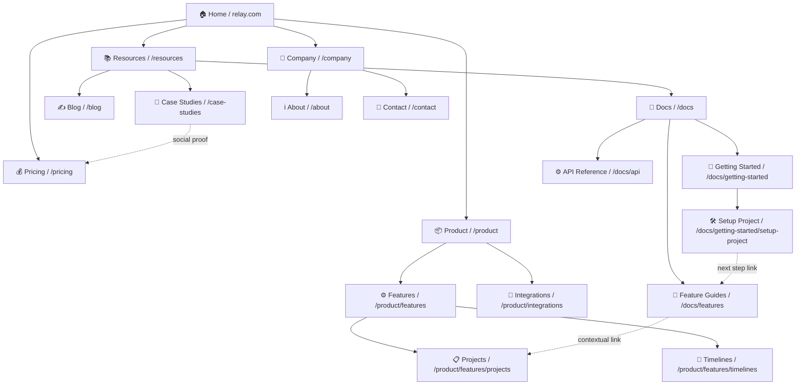

# Site Architecture Planner

Design a clear, scalable website structure that guides visitors naturally and supports your business goals.

## Purpose

A well-designed site architecture reduces friction, improves SEO, and helps users complete key actions. This skill guides you through mapping page hierarchy, planning navigation patterns, defining URL structures, and creating internal linking strategies that align with how your audience actually behaves.

## When to Use

1. **Launching a new website or major redesign** — You need a complete information architecture blueprint before building.
2. **Reorganizing an existing site** — Users get lost in your current structure; you're consolidating duplicate pages or clarifying categories.
3. **Scaling content** — Your site has grown into chaos; you need a system to accommodate new product lines, blog posts, or resources.
4. **Improving SEO and discoverability** — Pages aren't ranking well; you need to strengthen internal linking and fix broken hierarchies.
5. **Reducing support ticket volume** — Support reveals users can't find features or policies; navigation and page structure need rethinking.
6. **Preparing for a migration** — You're moving to a new platform and want to fix IA while you're at it.
7. **Optimizing conversion paths** — Your funnel is leaky; you need to restructure pages to guide visitors toward signup or purchase.

## Instructions

1. **Gather business context and site goals**
   - Clarify your site's primary purpose (education, conversion, community, product discovery).
   - List key business objectives (increase signups, improve support, boost engagement, drive sales).
   - Identify your top 3–5 user personas and their core needs.
   - Note any success metrics (page views, conversion rate, average session depth).

2. **Map your existing page inventory or plan new pages**
   - List all pages currently on your site (or pages you plan to create).
   - Group pages by theme or function (e.g., product features, pricing, docs, blog, community).
   - Identify orphan or redundant pages that should be merged or archived.
   - Mark pages that are high-traffic or high-conversion (use analytics data if available).

3. **Design your page hierarchy**
   - Apply the 3-click rule: users should reach any page in 3 clicks or fewer from the homepage.
   - Decide between a flat structure (fewer nesting levels) for simpler sites or a deeper hierarchy for complex products.
   - Assign each page a level: Homepage → Category → Subcategory → Detail Page.
   - Prioritize pages by importance; ensure high-traffic pages sit higher in the tree.

4. **Define URL structure and naming conventions**
   - Choose a naming pattern: `/category/subcategory/page-title` is clearer than `/article-123`.
   - Keep URLs short, descriptive, and keyword-aware for SEO.
   - Use hyphens (not underscores) to separate words.
   - Create a URL mapping table to document all patterns and apply them consistently.

5. **Design navigation systems**
   - Plan header navigation (5–7 main items; avoid dropdowns if possible).
   - Design footer navigation to include secondary links, legal, and company info.
   - Add breadcrumbs on detail pages so users always know where they are.
   - Consider sidebar navigation for documentation or multi-step processes.
   - Ensure mobile nav collapses gracefully without losing key links.

6. **Create a visual sitemap**
   - Use a Mermaid diagram to show your page hierarchy and interconnections.
   - Label each node with the page title and URL slug.
   - Use the diagram to spot orphan pages, overly deep branches, or missed linking opportunities.

7. **Plan internal linking strategy**
   - Adopt a hub-and-spoke model: core pages (hubs) link to related content (spokes); spokes link back to hubs.
   - Link related pages contextually (e.g., a "Getting Started" page links to feature guides).
   - Use descriptive anchor text ("Learn about pricing" instead of "Click here").
   - Plan cross-linking for SEO (category pages link to cornerstone content).

8. **Audit for gaps and orphaned content**
   - Identify pages with no inbound links.
   - Find pages deeper than 3 clicks from the homepage.
   - Check for broken internal links or missing redirects.
   - Plan a rollout strategy if you're restructuring existing URLs (include 301 redirects).

## Output Format

```
# Site Architecture for [Company Name]

## Business Context
- Primary purpose: [e.g., convert SMBs to project management platform]
- Key metrics: [e.g., signup rate, free-to-paid conversion, pages/session]
- Target personas: [list 3–5 with core needs]

## Page Hierarchy
[ASCII tree or numbered outline showing levels]

## URL Mapping
| Page Title | URL | Level | Priority |
|---|---|---|---|
| ... | ... | ... | ... |

## Navigation Specification
### Header Navigation
- [Item 1]: links to [page]
- [Item 2]: links to [page] (with dropdown for subcategories)

### Footer Navigation
- [Section 1]: [links]
- [Section 2]: [links]

### Breadcrumbs
- Applied on all pages deeper than level 2

## Visual Sitemap
[Mermaid diagram here]

## Internal Linking Strategy
- Hub pages: [list core pages that anchor content]
- Linking patterns: [describe how spokes link back to hubs]
- Example links: [show 3–5 specific internal link recommendations]

## Migration/Implementation Notes
- New URL redirects: [if restructuring]
- Pages to archive: [if consolidating]
- Timeline: [when to go live]
```

## Example

### Site Architecture for Relay — Project Management for Agencies

**Business Context**
- Primary purpose: Convert service agencies to Relay's project management platform
- Key metrics: Signup rate (current 2%, goal 4%), time-to-first-project (avg 8 min, goal 4 min), content-to-conversion rate (docs readers → paid users)
- Target personas:
  - Agency Owners (1–20 employees, need simple project oversight)
  - Project Managers (manage 5–15 concurrent projects; need reporting)
  - Team Leads (coordinate across disciplines; need collaboration tools)

**Page Hierarchy (ASCII)**
```
Relay Home
├── Product
│   ├── Features
│   │   ├── Projects
│   │   ├── Timelines
│   │   ├── Team Collaboration
│   │   └── Reporting
│   ├── Pricing
│   └── Integrations
├── Resources
│   ├── Docs (Hub)
│   │   ├── Getting Started
│   │   ├── Feature Guides
│   │   ├── API Reference
│   │   └── FAQs
│   ├── Blog
│   └── Case Studies
├── Company
│   ├── About
│   ├── Careers
│   ├── Contact
│   └── Security & Privacy
└── [Sign Up / Log In]
```

**URL Mapping**
| Page | URL | Level | Priority |
|---|---|---|---|
| Home | `/` | 1 | Critical |
| Product | `/product` | 2 | High |
| Features | `/product/features` | 3 | High |
| Projects Feature | `/product/features/projects` | 4 | Medium |
| Pricing | `/pricing` | 2 | High |
| Docs Home | `/docs` | 2 | High |
| Getting Started | `/docs/getting-started` | 3 | High |
| Setup Project | `/docs/getting-started/setup-project` | 4 | Medium |
| Blog | `/blog` | 2 | Medium |
| Blog Post | `/blog/[slug]` | 3 | Medium |
| Case Studies | `/case-studies` | 2 | Medium |
| Case Study Detail | `/case-studies/[slug]` | 3 | Medium |
| About | `/about` | 2 | Low |

**Navigation Specification**

*Header Navigation*
- Product (dropdown): Features, Pricing, Integrations
- Resources (dropdown): Docs, Blog, Case Studies
- About
- [Sign Up / Log In]

*Footer Navigation*
- Product: Features, Pricing, Integrations, Status
- Resources: Docs, Blog, Webinars
- Company: About, Careers, Contact
- Legal: Privacy, Terms, Security

*Breadcrumbs*
- Applied on pages level 3 and deeper
- Example: `/docs/getting-started/setup-project` shows: Docs > Getting Started > Setup Project

**Visual Sitemap (Mermaid)**


**Internal Linking Strategy**

*Hub Pages*
- `/product/features` — Central page linking to all feature detail pages
- `/docs` — Documentation hub linking to all guides and API docs
- `/blog` — Blog hub with category filters and related post links

*Linking Patterns (Hub-and-Spoke)*
- Feature pages (e.g., `/product/features/projects`) link back to `/product/features` in "Explore More Features"
- Blog posts link to relevant docs pages in "Learn More" CTAs
- Case studies link to pricing page to drive signup intent
- Docs breadcrumbs and "Next Steps" link users deeper or back to hubs

*Example Internal Links*
1. On `/docs/getting-started`: "Next: Setup Your First Project" → `/docs/getting-started/setup-project`
2. On `/product/features/projects`: "See it in action" → `/case-studies/agency-x-saves-20-hours`
3. On `/blog/5-tips-for-agencies`: "Learn how to use timelines" → `/docs/features/timelines`

**Migration/Implementation Notes**
- No URL restructuring needed (clean from day 1)
- Link from header + footer to `/docs` prominently (highest conversion path)
- Add contextual CTAs in footer of feature pages linking to `/pricing`
- Implement 301 redirects for any old blog URLs

## Edge Cases

1. **Multi-language sites:** Create separate URL hierarchies per language (`/en/`, `/es/`, etc.) or use subdomains. Update breadcrumbs and nav to reflect language. Use hreflang tags for SEO.

2. **E-commerce with 1000+ products:** Use a taxonomy-based URL structure (`/category/brand/product-name`). Implement faceted navigation and breadcrumbs that update dynamically. Avoid pagination in URLs; use infinite scroll or lazy loading.

3. **News or content-heavy sites:** Use date-based URLs (`/2026/03/article-title`) or topic-first (`/topic/article-title`). Maintain an archive hierarchy. Plan regular content pruning and link updates.

4. **Single-page applications (SPAs):** Use URL fragments (`/#/page-name`) or the History API for deep linking. Ensure breadcrumbs and nav reflect current state. Plan for shareable URLs and back-button behavior.

5. **Transitioning from old site to new:** Use a parallel structure during migration. Implement 301 redirects for all old URLs. Test redirect chains before going live. Update internal links in live content before launch.

6. **Highly personalized content:** Plan hierarchies that work for anonymous users first; personalization layers on top. Use breadcrumbs that reflect the current path, not the personalized path. Avoid deep linking issues caused by personalized content.
